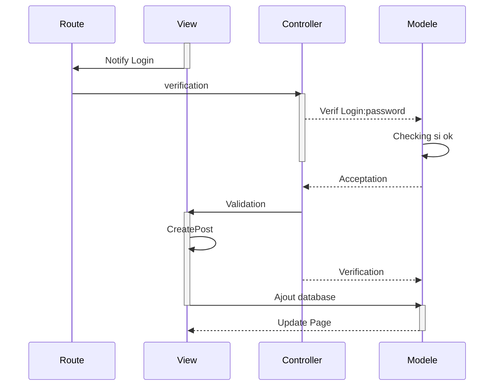

(site)
http://armougom-thomas.sprint-07-a.sc1lgvu9627.universe.wf/

(figma)
https://www.figma.com/proto/jNVFtXsf8DYAlwRFiyCeLz/Sprint_07?node-id=4%3A179&scaling=min-zoom&page-id=0%3A1&starting-point-node-id=4%3A179

